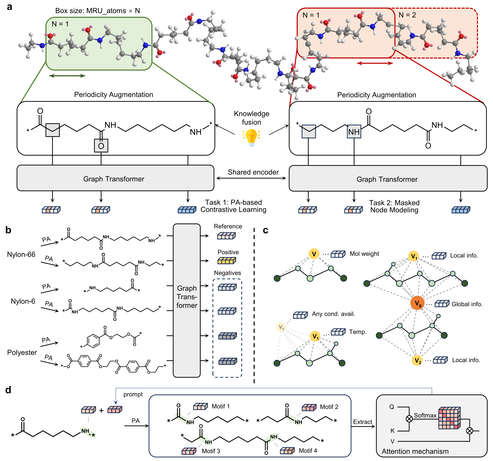

# Periodicity-aware foundation model for polymers
This is the official implementation of PerioGT, which is proposed in the article: [Periodicity-aware deep learning for polymers](https://www.nature.com/articles/s43588-025-00903-9).

## Table of Contents
- [Overview](#dart-overview)
- [System Requirements](#computer-system-requirements)
- [Environment Configuration](#gear-environment-configuration)
- [Project Structure](#open_file_folder-project-structure)
- [Quick Start](#rocket-quick-start)
  - [Download Pretrained Checkpoint](#download-pretrained-checkpoint)
  - [Option A: End-to-End Finetuning (Recommended)](#option-a-end-to-end-finetuning-recommended)
  - [Option B: Feature Extraction](#option-b-feature-extraction)
- [Full Training Workflow](#compass-full-training-workflow)
  - [Data Preprocessing](#1-data-preprocessing)
  - [Pretraining](#2-pretraining)
  - [Finetuning](#3-finetuning)
  - [Evaluation](#4-evaluation)
- [Contact](#envelope-contact)
- [Citation](#clipboard-citation)

## :bell: News
- `2025.12.01` **PerioGT 2.0** is under development, including (1) a topology-aware foundation model and (2) a distilled lightweight model designed for efficient deployment. Coming soon.
- `2025.11.20` Our paper *"Periodicity-aware deep learning for polymers"* has been published in [*Nature Computational Science*](https://www.nature.com/articles/s43588-025-00903-9). 

## :dart: Overview
PerioGT consists of three coponents:
1. **PolymerGraph construction.** Polymers have a complex multilevel structure, and the chemical structure of RUs alone is not sufficient to represent its structure. We provide a flexible mechanism that can adapt to more complex cases.
2. **Periodicity-aware pretraining.** We construct a chemical knowledge-driven sampling module as a periodicity prior and incorporate it into the model through contrastive learning.
3. **Periodicity prompt-guided finetuning.** We provide an option that aggregates the equivalent motifs in different RUs as a prompt in finetuning to emphasize the periodic structure of polymers.
<div align="center">
  
</div>

## :computer: System Requirements
This project has been tested under the following system:
- **Operating system**: Ubuntu 22.04 LTS
- **Memory (RAM)**: 256 GB
- **GPU**: NVIDIA RTX 4090
- **CUDA**: version 12.2


## :gear: Environment Configuration
Clone this repository:
```
git clone https://github.com/wuyuhui-zju/PerioGT.git
```
Navigate to the project directory and create the environment using Anaconda (this may take a few minutes):
```
cd PerioGT
conda env create
```
Activate the environment:
```
conda activate PerioGT
```
> *Note: Make sure you have [Anaconda](https://www.anaconda.com/products/distribution) or [Miniconda](https://docs.conda.io/en/latest/miniconda.html) installed before running the above commands.*

## :open_file_folder: Project Structure
The major folders and their functions in PerioGT are organized as follows:
```
├── PerioGT_common/          # Core implementation (including pretraining)
│   ├── checkpoints/         # Pretrained and finetuned model weights
│   ├── data/                # Data processing functions
│   ├── datasets/            # Raw and processed dataset files
│   ├── models/              # Model architectures
│   ├── scripts/             # Scripts for launching training and evaluation
│   ├── trainer/             # Training and evaluation logic (Trainer, Evaluator, etc.)
│   └── utils/               # Utility functions
├── PerioGT_copolym/         # Extension for copolymer property prediction
└── PerioGT_with_cond/       # Extension for homopolymers with additional information
```


## :rocket: Quick Start
This section provides a minimal example to get started with either end-to-end fine-tuning 
or feature extraction using the pretrained checkpoint. 
All commands in this section are assumed to be run from within the `PerioGT_common/scipts/` directory.

### Download Pretrained Checkpoint
Create the target directory to store the pretrained model:
```
mkdir -p checkpoints/pretrained/light/
```
Then download `pretrained_ckpt.zip` (350 MB) from [link](https://zenodo.org/records/17035498). 
Extract it and place the `base.pth` file into the directory you just created.


### Option A: End-to-End Finetuning (Recommended)
This option allows you to finetune the pretrained model on custom dataset in an end-to-end manner.

**Step 1: Prepare dataset (Optional)**

Take **dielectric constant** (`eps`) as an example; you can also replace it with your own property prediction task using the same structure.
Each dataset should be stored under a dedicated subdirectory inside `datasets/`, with a `.csv` file containing two columns:
```
smiles,value
*CC(*)C,2.61
*CC(*)F,3.36
*CO*,3.72
...
```
- `smiles`: The SMILES string of the repeating unit, where the dummy atoms (*) mark the repeating sites
- `value`: Target property (e.g., dielectric constant, glass temperature, band gap, etc.)

If using your own dataset, save it to `datasets/YOUR_DATASET/YOUR_DATASET.csv`. You can organize multiple datasets like this:
```
datasets/
├── eps/
│   └── eps.csv
├── YOUR_DATASET/
│   └── YOUR_DATASET.csv
└── ...
```

**Step 2: Split dataset (Optional)**

> The split file for `eps` dataset is already provided in this repo, you can skip this step. If you are using a custom dataset, you can generate a standard random split using the script below.

We provide a script that performs a random split (72% train / 8% val / 20% test) and saves the result as a `split.pkl` file:
```
python split_dataset.py --dataset YOUR_DATASET
```

**Step 3: Finetuning**

To quickly launch finetuning on the provided example dataset, run:
```
bash finetune_example.sh
```
If you are using your own dataset, open and modify `finetune_example.sh` to 
replace `eps` with your dataset name and update the training hyperparameters as needed.

### Option B: Feature Extraction
> *This option allows you to extract polymer embeddings from the pretrained model. Compared to Option A, feature extraction is faster and requires no training. However, it may lead to suboptimal performance, since the model is not fully adapted to the downstream dataset.*

To extract features from the provided example dataset, run:
```
bash extract_features_example.sh
```
This will generate an output file `features.npy`, containing per-polymer embeddings in NumPy format.
If you are using your own dataset, open and modify `extract_features_example.sh`, replacing `eps` with the name of your dataset.


## :compass: Full Training Workflow
This section provides a complete pipeline from raw data to model evaluation. 
 All commands in this section are assumed to be run from within the `PerioGT_common/scipts/` directory.
### 1. Data Preprocessing
> *In the pretraining stage, we incorporate a set of physicochemical descriptors to complement the graph-based representation. Since computing these descriptors (Mordred) is time-consuming, we recommend downloading our precomputed version for convenience.*

Download the following files from [link](https://zenodo.org/records/17035498): `pretrain_data_part1.zip`,`pretrain_data_part2.zip`,`pretrain_data_part3.zip`, and`pretrain_data_part4.zip`.
After downloading, unzip each file and merge their contents into the `datasets/pretrain/` directory.

If you need to use your own pretraining dataset, place the `.csv` file (with a `smiles` column) into `datasets/pretrain/`. Then run:
```
python prepare_pt_dataset.py --data_path ../datasets/pretrain/ --dataset YOUR_PRETRAIN_DATASET --n_jobs 32 --n_rus 3
```
- `--dataset`: Name of your custom pretraining dataset (without `.csv` extension)
- `--n_jobs`: Number of worker processes used for parallel data preprocessing
- `--n_rus`: Number of repeating units to generate for descriptor calculation (e.g., 3, 6, or 9)


### 2. Pretraining
We adopt a periodicity-aware self-supervised learning strategy to pretrain the polymer encoder on a large-scale polymer dataset.
To launch pretraining, run:
```
CUDA_VISIBLE_DEVICES=0,1,2 python -u -m torch.distributed.run \
    --nproc_per_node=3 \
    --nnodes=1 \
    pretrain.py \
    --save_path ../checkpoints/pretrained/light \
    --n_threads 8 \
    --n_devices 3 \
    --config base \
    --backbone light \
    --n_steps 100000 \
    --data_path ../datasets/pretrain/
```
- `--n_steps`: Total number of training steps
- `--backbone`: Backbone architecture for the encoder (`light` and `graphgps` are implemented here)
- Distributed training was adopted for efficient multi-GPU training. The following environment variables and flags control the distributed setup:
`CUDA_VISIBLE_DEVICES`, `--nproc_per_node`, `--nnodes`, `--n_devices`.

>*The pretraining process takes 50 hours on three RTX 4090 GPUs. We also provide a pretrained checkpoint that can be downloaded from the [link](https://zenodo.org/records/17035498). Download `pretrained_ckpt.zip`, extract it, and place the `base.pth` file into `checkpoints/pretrained/light/`.*


### 3. Finetuning
This section describes how to adapt the pretrained encoder to downstream property prediction tasks, using dielectric constant (`eps`) as an example.
First, perform preprocessing on the downstream dataset:
```
python prepare_ft_dataset.py \
    --dataset eps \
    --device cuda \
    --config base \
    --backbone light \
    --model_path ../checkpoints/pretrained/light/base.pth \
    --data_path ../datasets \
    --use_prompt
```
- `--dataset`: Name of the dataset (should match the folder name under `datasets/`)
- `--model_path`: The model path used for computing the prompt
- `--use_prompt`: Enables periodicity prompt encoding
- `--n_jobs`: Number of worker processes used for parallel data preprocessing

After dataset preparation, finetune the pretrained model using the following command:
```
python finetune.py \
    --config base \
    --backbone light \
    --mode finetune \
    --model_path ../checkpoints/pretrained/light/base.pth \
    --dataset eps \
    --weight_decay 0 \
    --dropout 0.05 \
    --lr 1e-4 \
    --device cuda
```
- `dataset`: Name of the dataset
- `--mode`: Training mode. Options:
    - `finetune`: End-to-end training of both encoder and prediction head
    - `freeze`: Freeze the encoder and only finetune the final prediction head
- `--save`: If set, enables saving of model checkpoints. (Flag argument: add `--save` to activate)
- `--save_suffix`: Required if `--save` is enabled. A custom string that will be appended to the checkpoint file name.
- `--lr`, `--dropout`, `--weight_decay`: These are the main optimization hyperparameters. 
The optimal values used in our experiments are provided in the paper. As a general starting point, setting `--lr 5e-4` has shown to produce reasonable performance in many cases, but tuning may be required depending on the dataset.


### 4. Evaluation
After finetuning, evaluate the model by running the following script if the checkpoint is saved:
```
python evaluation.py \
    --config base \
    --backbone light \
    --model_path ../checkpoints/eps/best_model.pth \
    --dataset eps \
    --dropout 0 \
    --device cuda
```
> *You can also download our finetuned checkpoints for direct evaluation. Please place the downloaded weights in the `checkpoints/eps/` directory.*

## :envelope: Contact
If you have any questions, please feel free to contact us at 12129020@zju.edu.cn.

## :clipboard: Citation
If this work is helpful for your research, please cite our paper.
```
@article{wu2025periodicity,
  title={Periodicity-aware deep learning for polymers},
  author={Wu, Yuhui and Wang, Cong and Shen, Xintian and Zhang, Tianyi and Zhang, Peng and Ji, Jian},
  journal={Nature Computational Science},
  pages={1--13},
  year={2025},
  publisher={Nature Publishing Group US New York}
}
```
